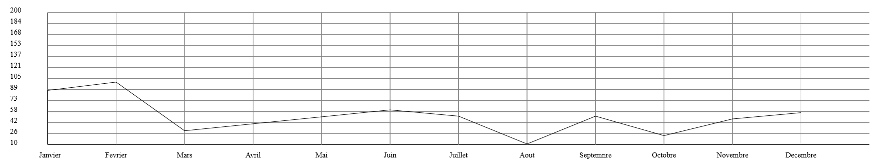
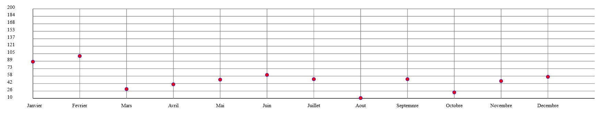
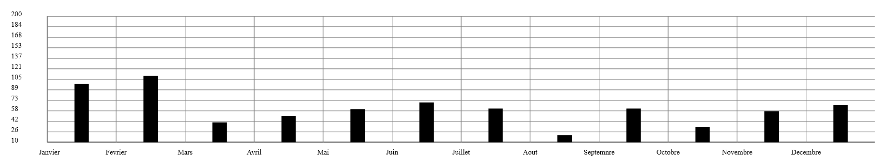
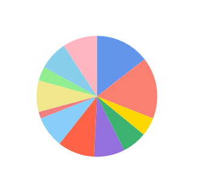
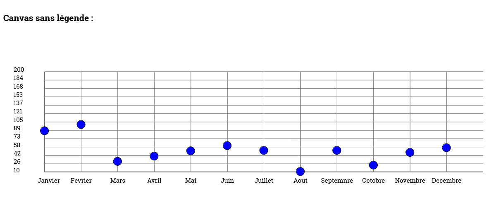
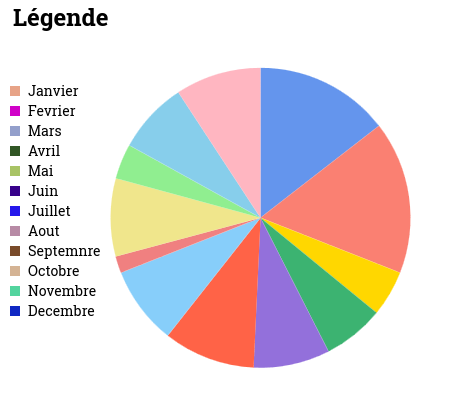
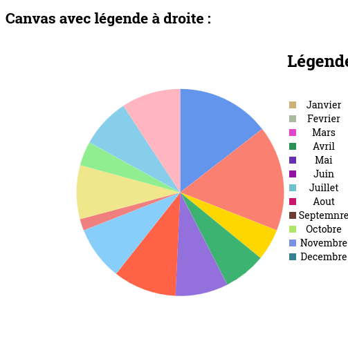
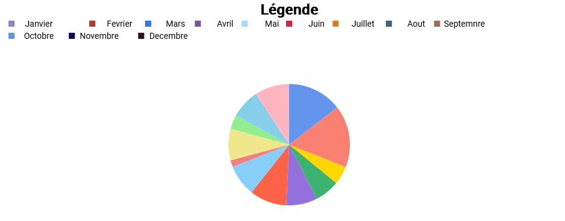
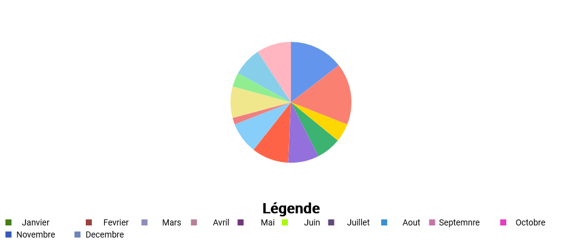

# Wild Chart School

[](#english-version)
[](#french-version)

[](LICENSE)
[](#)
[](#)
[](https://nodejs.org/)
[](https://www.npmjs.com/)
[](#)
[](CONTRIBUTING.md)
[](#)
[](#)


## English Version


## Welcome to your free open source library for data visualization.

Wild Chart School is a project maintained by the community, contributions are welcome!

Visualize your data in 4 different ways (4 chart types currently: bars, lines, points and pie charts).

The graph is responsive and resizes automatically with the window.

It can be used as soon as it is installed with test data or by replacing it with its own, while retaining the structure given below.


## Getting started with WildChartSchool

### Installation

Download and install with npm with:

```bash
npm i wcs-chart-lib
```

Or clone this repository  (you will be able to download the library with npm install chart-wcs)

```bash
  git clone git@github.com:WildCodeSchool-CDA-LYON-02-2024/wcs-chart-lib.git

```
    
### Usage

The WCS component allows to display a Chart by passing different props (dataset,
config, theme).

Implementation exemple code 
``` js
 <WCS config={config} dataset={dataset} />
```
 Example of the dataset object, the structure does not change depending on the chart type :

``` js
const dataset = [
    {
      tag: "Titre",
      data: {
        labels: [
          "Janvier",
          "Février",
          "Mars",
          "Avril",
          "Mai",
          "Juin",
          "Juillet",
          "Août",
          "Septembre",
          "Octobre",
          "Novembre",
          "Décembre",
        ],
        values: [88, 100, 30, 40, 50, 60, 51, 11, 51, 23, 47, 56],
      },
    },
  ];
```

This is an array, with an object:
- **tag** (type: string): The title of the chart
- **data**: Another object with:
- **labels** (type: value table of type “string”): Represents the labels associated with the values (for example, “January” will be displayed below the value “10”, thus label[i]=values[i]);
- **values**: Represents the values to display in the chart (this is a value table of type number int)


**The different chart types: bar, line, point, pie...** 


The chart type is defined in the config object and is mandatory for the component to function, even if it is empty.
The chart type is defined with type (type string): if no value is supplied, it will default to **“point”**.
Possible values: **“bar”**, “point”, “line”, “pie”.


The configuration examples config explain the properties specific to each type of graphic. If a property is present for one type of graphic and absent for another, it's simply not functional.
type, height and width properties are common to all graphics.

**Example for the line chart :** 
``` js
  const config = {
    type: 'line',
    height: 1000,
    width: 1000,
  };
```
- type (string type): if no value is provided, it will default to “point”.
- (type number int): if no value is provided, height will be equal to the size of the browser window (innerHeight) divided by two
- width (type number int), if no value provided, width will be equal to 100% of the browser window width (innerWidth)





**Example for the point chart :**
  ``` js
  const config = {
    type: 'point',
    toLine: false,
    grid: true,
    radius: 5,
    fillColor: 'red',
    strokeColor: 'blue',
  };
```
- **toLine** (Boolean), defaulted to false, this option connects the points together.
- **grid** (Boolean), defaults to true, this option allows you to display or not the grid on the graph, this grid is drawn from the number of values provided in the values table in dataset.
- **radius** (type number, accepts one digit after the decimal point), this option defines the size of the point on the graph. By default, radius = 2.
- **fillColor** (type string): this option lets you change the color of the dot. Default fillColor = “black”.
- **strokeColor** (type string): this option changes the color of the point outline. Default strokeColor = “black



**Example for the bar chart :** 
 ``` js
 const config = {
    type: 'bar',
    radius: 30,
    fillColor: 'blue',
  };
```
- **radius** (type number, accepts one digit after the decimal point), this option defines the width of the bar on the graph. By default, radius = 10.
- **fillColor** (type string): this option lets you change the color of the bars. Default fillColor = “black”.



**Example of a pie chart :** 
 ``` js
 const config = {
    type: 'pie',
    radius: 100,
  };
  ```
- **radius** (type number, accepts one digit after the decimal point), this option defines the radius of the pie chart. By default, radius = height - spacing, spacing is not modifiable for the moment and is equal to 100px.




The **theme object** is not required for the component to function correctly, as it takes a default theme.
The theme object will be used to customize graphic colors, font size, fonts, line thickness, etc...
See all the possibilities on storybook
N B : For the moment, the theme is not functional, and the color and size parameters are in the config object.

**Example of legend display :**
```js
<WCS config={config} dataset={dataset} legend='onTop' />
```

**Legend takes 4 possible parameters (in string):**
- **"none"** : Legend is not displayed,
- **"top"**: The legend is displayed at the top (note that if the pie chart has a radius greater than 150, it may overflow onto the legend),
- **"bottom"**: The legend is displayed at the bottom (note that if the pie chart has a radius greater than 150, it may overlap the legend),
- **"left"**: The legend is displayed on the left (do not use in charts other than pie chart, otherwise the axis labels will overlap),
- **"right"**: Legend is displayed on the right.


For greater clarity, we'll show you examples with the pie chart.
For other charts, only the "onTop" parameter is relevant.

*Without legend ("none") :*



*Legend at left ("left") :*



*Legend at right ("right") :*



*Legend on top ("top") :*



*Legend on bottom ("bottom") :*

